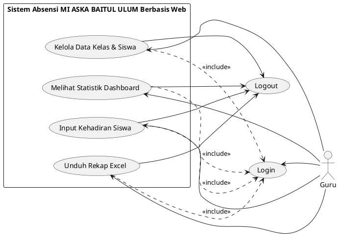
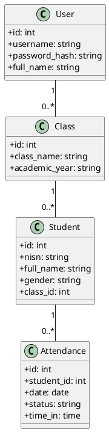
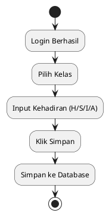

# BAB IV: PELAKSANAAN KERJA PRAKTIK

Pada bagian ini dijelaskan mengenai pelaksanaan Kerja Praktik meliputi tahapan input, proses, dan pencapaian hasil yang diperoleh selama pengembangan **Rancang Bangun Aplikasi Absensi Siswa Berbasis Web Menggunakan Framework Flask di MI Aska Baitul Ulum**.

## IV.1 Input
Tahap input dalam pelaksanaan Kerja Praktik ini melibatkan proses pengumpulan data serta identifikasi kebutuhan fungsional yang diperlukan dalam pembangunan sistem presensi siswa. Berdasarkan hasil observasi dan arahan dari pihak instansi MI Aska Baitul Ulum, data input yang diidentifikasi meliputi:

1.  **Data Master**: Mencakup data Guru, Siswa, Kelas, dan Tahun Ajaran yang diperoleh dari administrasi sekolah. Data tersebut menjadi dasar utama dalam pengelolaan sistem informasi kehadiran.
2.  **Kebutuhan Fungsional**: Meliputi fitur-fitur utama seperti manajemen autentikasi (login), pencatatan kehadiran harian secara *real-time*, serta pengelolaan data siswa dan kelas secara digital.
3.  **Perangkat Lunak dan Perangkat Keras**: Untuk menunjang pembangunan sistem, digunakan perangkat lunak berupa **framework Flask (Python)** sebagai dasar pengembangan aplikasi, **SQLite** sebagai basis data penyimpanan, serta **HTML, CSS, dan Vanilla JS** untuk perancangan antarmuka pengguna.

Kebutuhan sistem kemudian didokumentasikan dalam bentuk *Software Requirements Specification* (SRS). Sebagai penunjang kegiatan Kerja Praktik, tersedia fasilitas berupa:
*   Laptop untuk pengembangan sistem.
*   Jaringan internet sekolah.
*   Data siswa dan data kelas dari pihak sekolah.

Dasar teori yang diperoleh selama perkuliahan juga menjadi input penting dalam memahami konsep pemrograman web dan pengelolaan basis data.

## IV.2 Proses
Pelaksanaan Kerja Praktik dibagi menjadi beberapa tahapan utama, yaitu:
1.  Eksplorasi
2.  Pembangunan perangkat lunak
3.  Pelaporan hasil Kerja Praktik

Selama proses pengembangan, terdapat beberapa kendala seperti penyesuaian kebutuhan sistem dengan kondisi sekolah. Kendala tersebut diselesaikan melalui diskusi dengan guru dan penyesuaian fitur aplikasi.

### IV.2.1 Eksplorasi
Tahap eksplorasi dilakukan dengan mempelajari proses absensi manual yang berjalan di MI Aska Baitul Ulum serta melakukan observasi untuk memahami alur pencatatan kehadiran siswa. Pada tahap ini juga dilakukan pendalaman terhadap:
*   **Framework Flask (Python)**
*   Konsep **MVC (Model, View, Controller)** pada Flask
*   Perancangan basis data menggunakan **SQLAlchemy**
*   Pemodelan sistem menggunakan **UML**

Eksplorasi bertujuan agar sistem yang dikembangkan sesuai dengan kebutuhan sekolah. Selain itu, dilakukan juga instalasi *tools* pendukung seperti **Python**, **Visual Studio Code**, dan library pendukung lainnya (Flask-SQLAlchemy, Flask-Login, Flask-Bcrypt). Hasil dari tahap eksplorasi ini direpresentasikan dalam **Use Case Diagram** sebagai berikut:

**Gambar 4.1 Use Case Diagram Sistem Absensi MI ASKA BAITUL ULUM**

### IV.2.2 Pembangunan Perangkat Lunak
Tahap ini merupakan inti dari pelaksanaan kerja praktik, yang meliputi perancangan struktur data, antarmuka, dan logika program.

#### A. Perancangan Basis Data
Berdasarkan analisis kebutuhan, dirancang sebuah **Class Diagram** untuk menggambarkan hubungan antar model data:

**Gambar 4.2 Class Diagram**

Detail dari perancangan basis data tersebut dituangkan ke dalam **Kamus Data** sebagai berikut:

**Tabel 4.1 Struktur Tabel `user`**
| Nama Kolom | Tipe Data | Ukuran | Keterangan |
| :--- | :--- | :--- | :--- |
| `id` | Integer | 11 | Primary Key, Auto Increment |
| `username` | Varchar | 50 | Nama pengguna untuk login (Unik) |
| `password` | Varchar | 255 | Hash kata sandi untuk keamanan |
| `full_name` | Varchar | 100 | Nama lengkap Guru |

**Tabel 4.2 Struktur Tabel `class`**
| Nama Kolom | Tipe Data | Ukuran | Keterangan |
| :--- | :--- | :--- | :--- |
| `id` | Integer | 11 | Primary Key, Auto Increment |
| `class_name` | Varchar | 20 | Nama kelas (Misal: Kelas 1-A) |
| `academic_year`| Varchar | 20 | Tahun ajaran (Misal: 2023/2024) |

**Tabel 4.3 Struktur Tabel `student`**
| Nama Kolom | Tipe Data | Ukuran | Keterangan |
| :--- | :--- | :--- | :--- |
| `id` | Integer | 11 | Primary Key, Auto Increment |
| `nisn` | Varchar | 20 | Nomor Induk Siswa Nasional (Unik) |
| `full_name` | Varchar | 100 | Nama lengkap siswa |
| `gender` | Varchar | 1 | Jenis Kelamin (L/P) |
| `class_id` | Integer | 11 | Foreign Key ke `class.id` |

**Tabel 4.4 Struktur Tabel `attendance`**
| Nama Kolom | Tipe Data | Ukuran | Keterangan |
| :--- | :--- | :--- | :--- |
| `id` | Integer | 11 | Primary Key, Auto Increment |
| `student_id` | Integer | 11 | Foreign Key ke `student.id` |
| `date` | Date | - | Tanggal pelaksanaan absensi |
| `status` | Varchar | 1 | Status (H=Hadir, S=Sakit, I=Izin, A=Alpa) |
| `time_in` | Time | - | Waktu data diinput |

#### B. Perancangan Alur Kerja (Activity Diagram)
Untuk memastikan sistem berjalan sesuai skenario use case, dibuat beberapa **Activity Diagram** sebagai berikut:

**Gambar 4.3 Activity Diagram Input Kehadiran Siswa**

#### C. Implementasi Kode & Pengujian
Pembangunan aplikasi dilakukan menggunakan framework Flask dengan struktur MVC yang memisahkan antara logika bisnis, representasi data, dan antarmuka pengguna. Untuk memastikan perangkat lunak berfungsi sebagaimana mestinya, dilakukan pengujian menggunakan metode **Black Box Testing**. Fokus pengujian adalah pada fungsionalitas antarmuka tanpa melihat alur kode di dalamnya.

**Tabel 4.5 Hasil Pengujian Black Box**
| ID | Fitur / Skenario | Langkah Pengujian | Hasil yang Diharapkan | Status |
| :--- | :--- | :--- | :--- | :--- |
| BB-01 | Login (Valid) | Memasukkan username dan password yang terdaftar. | Sistem berhasil mengautentikasi dan masuk ke Dashboard. | Berhasil |
| BB-02 | Login (Invalid) | Memasukkan password yang salah atau akun tidak terdaftar. | Sistem menampilkan pesan error "Username atau password salah". | Berhasil |
| BB-03 | Keamanan Akses | Mengakses URL `/dashboard` secara langsung tanpa login. | Sistem secara otomatis mengalihkan (redirect) ke halaman Login. | Berhasil |
| BB-04 | Pilih Kelas | Menekan kartu/tombol kelas "Kelas 1-A" pada dashboard. | Sistem menampilkan daftar nama siswa yang terdaftar di kelas tersebut. | Berhasil |
| BB-05 | Input Absensi | Memilih status (H/S/I/A) bagi beberapa siswa dan menekan "Simpan". | Data tersimpan ke database dan muncul notifikasi "Absensi berhasil disimpan". | Berhasil |
| BB-06 | Unduh Rekap Excel | Menekan tombol "Unduh Excel" di halaman kelas. | Sistem mengirimkan file format .xlsx yang berisi rekap kehadiran siswa. | Berhasil |
| BB-07 | Logout | Menekan tombol "Keluar/Logout" pada sidebar. | Sesi pengguna dihapus dan sistem kembali ke halaman Login. | Berhasil |

Berdasarkan hasil pengujian di atas, seluruh fitur utama Sistem Absensi Siswa MI Aska Baitul Ulum telah berfungsi 100% sesuai dengan analisis kebutuhan awal.

### IV.2.3 Pelaporan Hasil Kerja Praktik
Tahap pelaporan merupakan fase final dari seluruh rangkaian kegiatan kerja praktik. Pada tahap ini, seluruh hasil kerja yang telah dilakukan didokumentasikan secara formal.

## IV.3 Pencapaian Hasil
Hasil yang dicapai dari Kerja Praktik di MI Aska Baitul Ulum ini adalah sebuah aplikasi **Absensi Siswa Berbasis Web** dengan fungsionalitas utama:
*   **Autentikasi Aman**: Login guru MI Aska Baitul Ulum.
*   **Modul Data Siswa**: Pengelolaan data siswa sesuai database madrasah (MI).
*   **Proses Presensi Digital**: Pencatatan kehadiran digital yang menggantikan buku absen manual.
*   **Otomasi Laporan**: Fitur unduh rekapitulasi kehadiran dalam format Excel untuk mempermudah pelaporan bulanan madrasah.

Beberapa dokumen pendukung yang dihasilkan meliputi:
*   **Software Requirements Specification**: Analisa kebutuhan fungsional.
*   **Software Design Document**: Dokumentasi diagram UML (Use Case, Class, Activity).
*   **User Manual**: Panduan penggunaan bagi guru.
