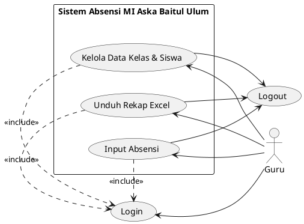
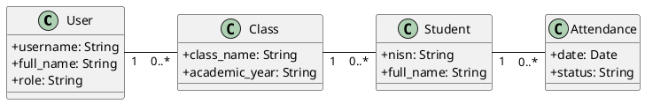
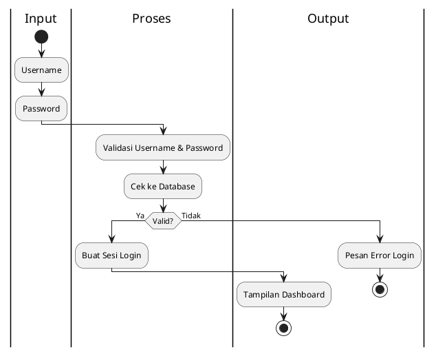
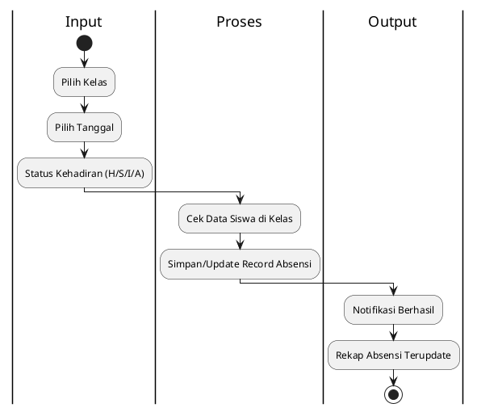
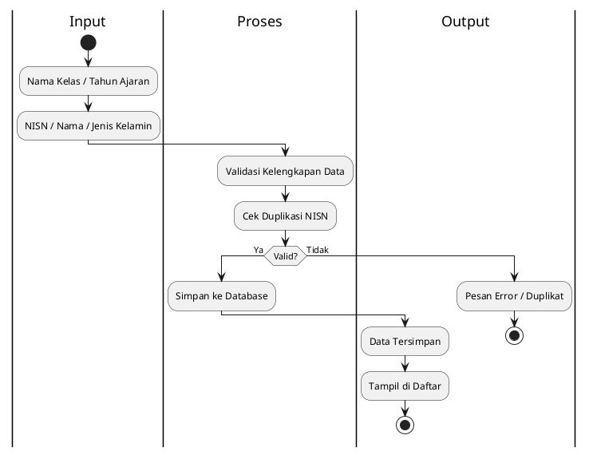
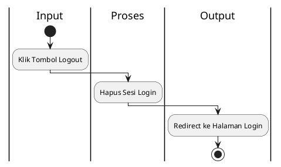

# DOKUMENTASI DIAGRAM SISTEM (PLANTUML)

Dokumen ini berisi kode PlantUML untuk aplikasi **Sistem Absensi MI Aska Baitul Ulum**.

## 1. Use Case Diagram

## 2. Class Diagram

## 3. Activity Diagram — Login

## 4. Activity Diagram — Input Absensi

## 5. Activity Diagram — Kelola Data Kelas & Siswa

## 6. Activity Diagram — Logout

